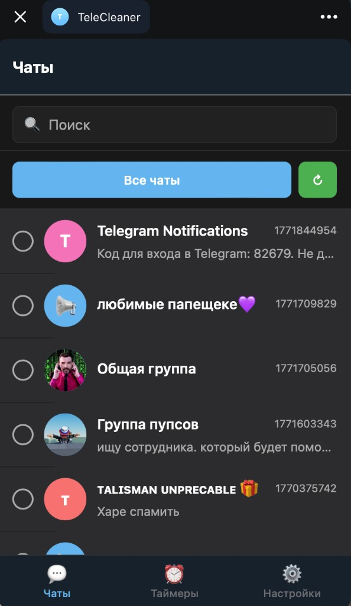
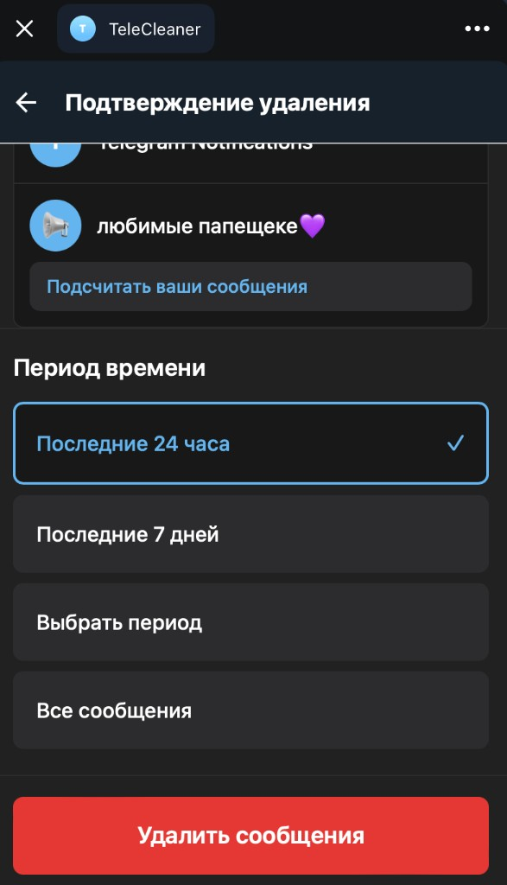
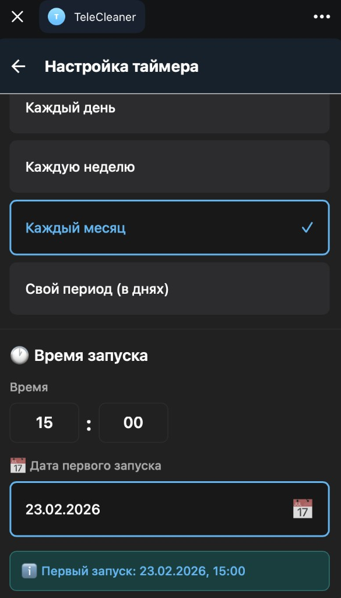
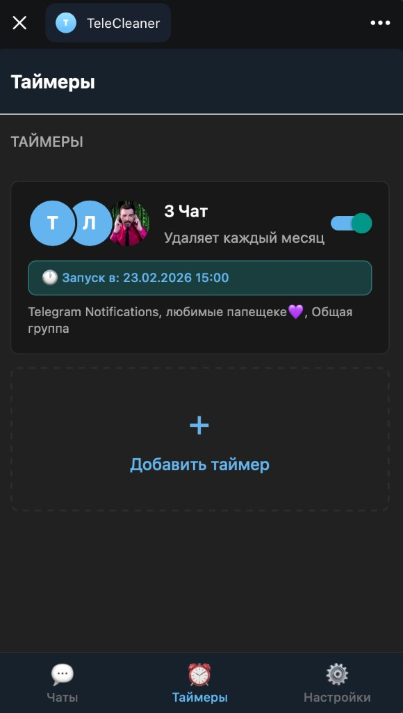
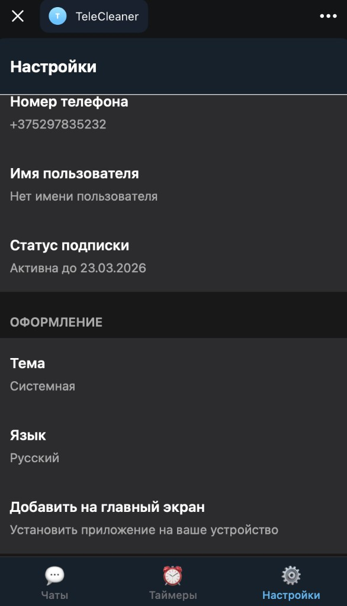

# Telegram Message Cleaner

A mobile app built with Expo and React Native that helps users efficiently delete their own messages from Telegram chats based on specific time intervals.

## Скриншоты приложения

| Чаты | Подтверждение удаления | Настройка таймера |
|------|------------------------|-------------------|
| [](assets/screenshots/chats.png) | [](assets/screenshots/delete-confirmation.png) | [](assets/screenshots/timer-settings.png) |

**Чаты** — список чатов с поиском и фильтром «Все чаты», выбор чатов для удаления сообщений или настройки таймера.

**Подтверждение удаления** — выбор периода (последние 24 часа, 7 дней, свой период или все сообщения) и кнопка «Удалить сообщения».

**Настройка таймера** — периодичность (каждый день / неделю / месяц или свой период в днях), время и дата первого запуска.

| Таймеры | Настройки |
|---------|-----------|
| [](assets/screenshots/timers.png) | [](assets/screenshots/settings.png) |

**Таймеры** — список таймеров по чатам с отображением расписания и переключателем вкл/выкл, кнопка «Добавить таймер».

**Настройки** — номер телефона, имя пользователя, статус подписки, тема, язык и установка приложения на главный экран.

## Features

- 📱 Phone number authentication via Telegram API
- 💬 Chat listing with familiar Telegram-style UI
- ⏰ Delete messages by time intervals (last day, last week, or all)
- ✅ Multi-chat selection with checkboxes
- 🔄 Real-time deletion progress tracking
- 🎨 Clean, intuitive interface following Telegram's design language

## Tech Stack

- **Framework:** Expo (React Native)
- **Language:** TypeScript
- **Navigation:** Expo Router
- **Styling:** NativeWind (Tailwind CSS for React Native)
- **Backend:** Supabase
- **Deployment:** Expo Application Services (EAS)

## Prerequisites

- Node.js (v18 or higher)
- npm or yarn
- Expo CLI
- iOS Simulator (for Mac) or Android Emulator

## Setup Instructions

1. **Clone the repository**
   ```bash
   git clone <repository-url>
   cd TeleCleaner
   ```

2. **Install dependencies**
   ```bash
   npm install
   ```

3. **Configure environment variables**
   - Copy `.env.example` to `.env`
   - Fill in your Supabase and Telegram API credentials

4. **Start the development server**
   ```bash
   npm start
   ```

5. **Run on your device**
   - Scan the QR code with Expo Go app (iOS/Android)
   - Or press `i` for iOS simulator or `a` for Android emulator

## Project Structure

```
TeleCleaner/
├── app/                    # Expo Router pages
│   ├── (auth)/            # Authentication screens
│   ├── (tabs)/            # Main app screens
│   └── _layout.tsx        # Root layout
├── components/            # Reusable components
├── lib/                   # Utilities and services
│   ├── supabase.ts       # Supabase client
│   └── telegram.ts       # Telegram API integration
├── types/                 # TypeScript type definitions
└── assets/               # Images, fonts, etc.
```

## Development

- **Type checking:** `npm run type-check`
- **Linting:** `npm run lint`

## Deployment

Build and deploy using EAS:

```bash
eas build --platform android
eas build --platform ios
eas submit
```

## License

MIT
